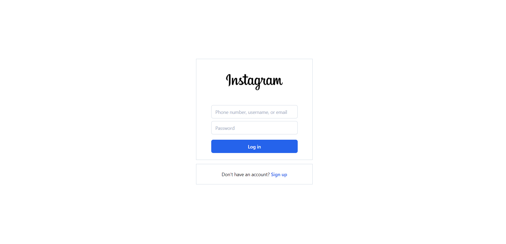
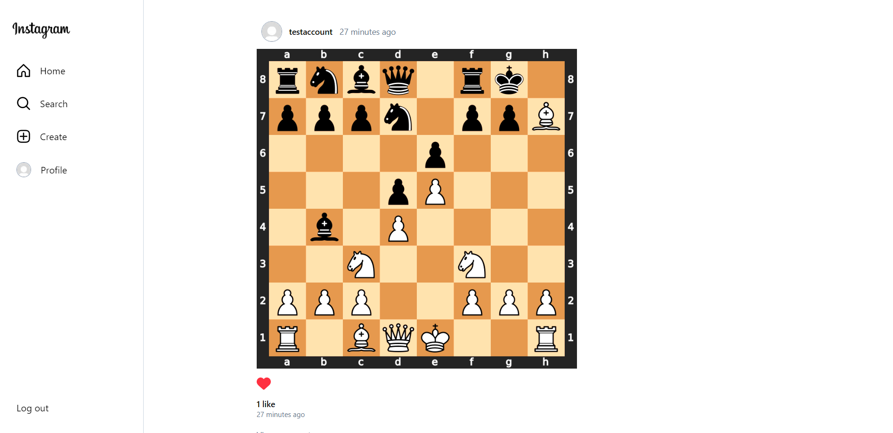
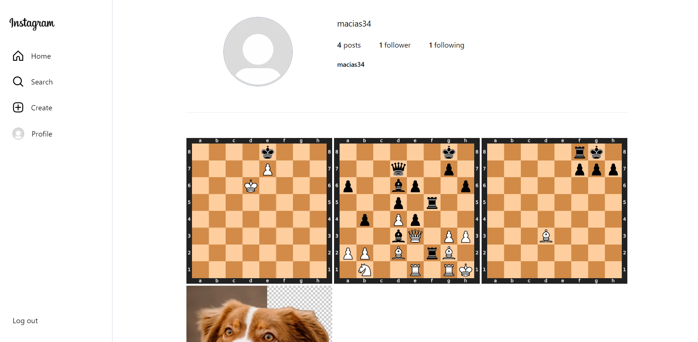
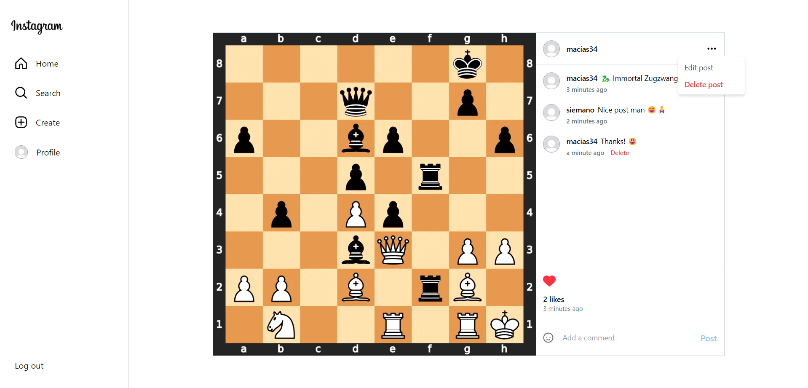
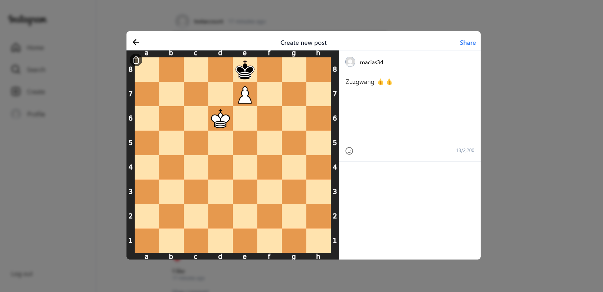
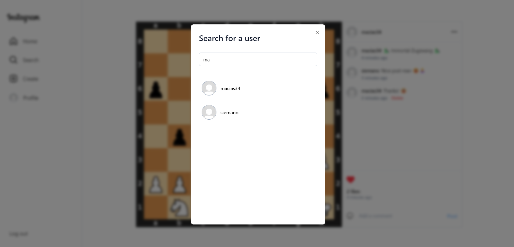

# 📷 Instagram Clone

# 🌅 Preview links :
- [🏠 Home page](https://instagram-clone-propiesek.vercel.app/)
- [👤 Profile page](https://instagram-clone-propiesek.vercel.app/macias34)
- [📝 Post page](https://instagram-clone-propiesek.vercel.app/p/clgs50fyi0017ick86ntbsv3q)

# 📚 Table of Contents

- [📝 About the app](#📝-about-the-app)
  - [🚀 Features](#🚀-features)
- [💡 Motivation](#💡-motivation)
- [🛠️ Technology stack](#🛠️-technology-stack)
- [📷 Screenshots](#📷-screenshots)
  - [🔒 Auth page](#🔒-auth-page)
  - [🏠 Home page](#🏠-home-page)
  - [👤 Profile page](#👤-profile-page)
  - [📝 Post page](#📝-post-page)
  - [➕ Post creation](#➕-post-creation)
  - [🔎 Search for a user](#🔎-search-for-a-user)
- [📞 Contact](#📞-contact)

# 📝 About the app
A clone of the Instagram.

## 🚀 Features
- creating, managing and displaying posts
- follow other people
- like and comment posts
- show followings' posts on home page
- search for a user

# 💡 Motivation
My motivation was to improve my coding skills and learn T3 Stack, while creating a fun project. 

# 🛠️ Technology stack

- [T3 Stack](https://create.t3.gg/) - For dynamic type safety on front-end and backend
  - [Next 13 (React)](https://nextjs.org/) - For front-end
  - [Tailwind](https://tailwindcss.com/) - For styling
  - [Typescript](https://www.typescriptlang.org/) - For type safety
  - [TRPC](https://trpc.io/) - For back-end
  - [NextAuth](https://next-auth.js.org/) - For auth
  - [Prisma](https://www.prisma.io/) - As a ORM for database
  - [React Query](https://tanstack.com/query/v3/) - For fetching and caching data
  - [zod](https://zod.dev/) - For type safe inputs
- [shadcn/ui](https://ui.shadcn.com/) - As a UI library
- [PlanetScale](https://planetscale.com/) - As the database (mysql)
- [supabase](https://supabase.com/) - As the storage
- [Formik](https://formik.org/) - For managing forms
- [Vercel](https://vercel.com/) - For deployment

# 📷 Screenshots

## 🔒 Auth page

## 🏠 Home page

## 👤 Profile page

## 📝 Post page

## ➕ Post creation

## 🔎 Search for a user

# 📞 Contact
Feel free to contact me, message me on Discord @macias#9277 😄🙏.
